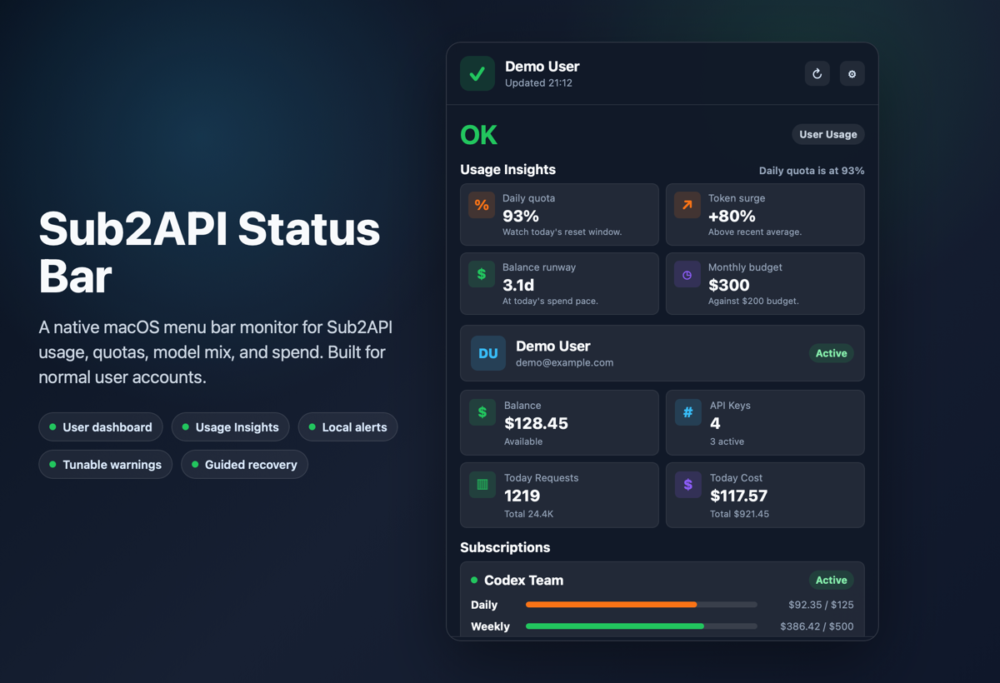

# Sub2API Status Bar

Sub2API Status Bar is a macOS menu bar companion for Sub2API users. It keeps daily spend, token usage, quota pressure, model distribution, and subscription limits visible without keeping the web dashboard open.



## Highlights

- Native macOS menu bar app with a compact SwiftUI popover
- User dashboard cards for balance, API keys, requests, spend, token totals, RPM/TPM, and response time
- Subscription quota card with separate daily, weekly, and monthly progress bars
- Seven-day token trend and model distribution
- Optional menu bar text summary with multiple compact modes, for example `$120.75 · 1219 req · 3 RPM`
- Customizable panel layout so users can hide less important dashboard sections
- First-run login and optional manual Bearer token setup
- Multiple saved accounts with quick switching
- Launch at Login, manual refresh, copied diagnostics, and config-file reveal actions
- Stale-data detection so delayed refreshes are called out as `Needs Refresh`
- Local alert thresholds for daily spend, daily tokens, and subscription quota pressure
- MAGI productization roadmap with release-readiness gates and maturity backlog
- Local config storage; no telemetry or third-party analytics
- GitHub Releases update checking from Settings

## Requirements

- macOS 13 or later
- Swift 6.1 or later for local development
- A Sub2API server with user API endpoints enabled

## User API Endpoints

The app expects a Sub2API server with `/api/v1` endpoints:

- `POST /api/v1/auth/login`
- `GET /api/v1/auth/me`
- `GET /api/v1/subscriptions/summary`
- `GET /api/v1/usage/dashboard/stats`
- `GET /api/v1/usage/dashboard/trend`
- `GET /api/v1/usage/dashboard/models`

Requests send `Authorization: Bearer <token>` after login or manual token setup.

## Run From Source

```bash
swift run Sub2APIStatusBar
```

On first launch, click the menu bar icon and fill:

- Server URL, for example `https://sub2api.example.com`
- Account email
- Password

Non-secret preferences are saved at:

```text
~/Library/Application Support/Sub2APIStatusBar/config.json
```

Login tokens are stored in the same local config file. The app does not use macOS Keychain.

To switch accounts or remove saved credentials, open Settings and choose **Disconnect**.

Settings also includes:

- **Show text in menu bar** for a compact always-visible usage summary
- **Summary mode** to switch the menu bar text between spend, token throughput, and quota emphasis
- **Layout** controls to show or hide account, metrics, subscriptions, model distribution, and token trend sections
- **Launch at login** so the monitor starts with macOS
- **Copy Diagnostics** for support-safe status details with tokens redacted
- **Show Config** to reveal the local `config.json`

Optional first-run environment variables:

```bash
SUB2API_BASE_URL=https://sub2api.example.com \
SUB2API_AUTH_TOKEN=your-token \
SUB2API_SHOW_MENU_BAR_TEXT=true \
swift run Sub2APIStatusBar
```

## Build A macOS App

```bash
VERSION=v0.1.6 ./scripts/build-app.sh
```

If `VERSION` is omitted, release scripts read the current tag from the repository `VERSION` file.

Output:

```text
dist/Sub2APIStatusBar.app
```

The build script generates the app icon, copies bundle resources, and applies ad-hoc signing by default. To sign with a Developer ID certificate:

```bash
SIGN_IDENTITY="Developer ID Application: Your Name (TEAMID)" \
VERSION=v0.1.6 \
./scripts/build-app.sh
```

## Package A Release

```bash
VERSION=v0.1.6 ./scripts/verify-release-candidate.sh
```

Output:

```text
dist/Sub2APIStatusBar-0.1.6-macOS.zip
dist/Sub2APIStatusBar-0.1.6-macOS.zip.sha256
dist/Sub2APIStatusBar-0.1.6-macOS.dmg
dist/Sub2APIStatusBar-0.1.6-macOS.dmg.sha256
dist/Sub2APIStatusBar-0.1.6-macOS-manifest.json
```

## Notarize A Release

After signing with a Developer ID Application certificate, notarize and staple the app with:

```bash
APPLE_ID="you@example.com" \
TEAM_ID="TEAMID" \
APP_SPECIFIC_PASSWORD="xxxx-xxxx-xxxx-xxxx" \
SIGN_IDENTITY="Developer ID Application: Your Name (TEAMID)" \
VERSION=v0.1.6 \
./scripts/notarize-release.sh
```

## Updates

The app checks GitHub Releases once on launch and lets users check manually from Settings > Updates. When a newer release is available, the popover shows a small update banner with a link to the download page.

GitHub only exposes published releases through the public latest-release API. Draft releases are intentionally not shown to users.

## Productization Roadmap

The project uses a MAGI spiral for product work:

- 审视: compare the current app with mature menu bar, AI observability, and macOS distribution products.
- 执行: ship one small, verifiable product improvement.
- 提升: record the next quality bar in `docs/PRODUCT_REVIEW.md`.

The current roadmap lives in `docs/superpowers/specs/2026-05-20-magi-productization-design.md`.

## Development Checks

```bash
./scripts/verify-release-candidate.sh
```

GitHub Actions runs the same checks on `main`, pull requests, tags, and manual workflow dispatches.

For contribution workflow, product standards, documentation expectations, and PR checks, see [CONTRIBUTING.md](CONTRIBUTING.md).

## Support

For bugs and product feedback, open a GitHub Issue using the bug or feature template. Settings > Diagnostics > Copy Diagnostics provides a support-safe report with token values redacted.

Do not share `config.json`, access tokens, refresh tokens, passwords, or private server logs. See [SUPPORT.md](SUPPORT.md) for the support checklist and privacy boundary.

For vulnerabilities, use the private reporting guidance in [SECURITY.md](SECURITY.md) rather than opening a public issue.

## Troubleshooting

If Swift reports that a PCH was compiled with a different module cache path, the project was probably moved or renamed while `.build` still points at the old folder. Clean the local build cache and run again:

```bash
./scripts/clean-build-cache.sh
swift run Sub2APIStatusBar
```

## Privacy

Sub2API Status Bar stores the server URL, auth token, refresh token, display preferences, account list, and refresh interval in the local Application Support config file. It does not use macOS Keychain and does not send data anywhere except the configured Sub2API server and GitHub Releases when checking for updates.

## Acknowledgements
Thanks to the [LinuxDo](https://linux.do/) community for the discussions, sharing, and feedback.

## License

MIT
